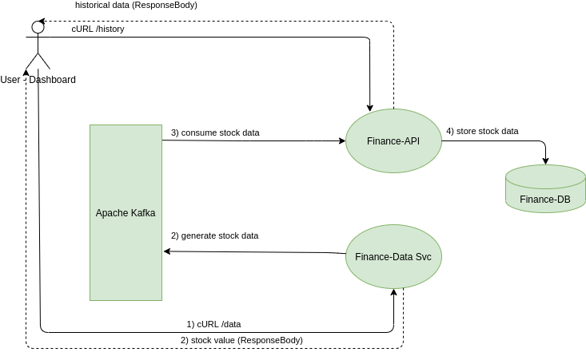

# Finance-API

The following service is part of the "Live Finance Demo".
It is a simple Spring REST reactive service that consumes the stock value generated by Finance-Data-Svc, stores those value in a DB for historical purposes and exposes RESTful apis to users who can inquire about those values



The other service "Finance-Data-Svc" produces the stocks data

## How-To

1. Ensure Kafka is started. Use the docker-compose file "Kafka-dockercompose.yml"
    ````
   docker-compose -f Kafka-dockercompose.yml up
   ````
   
2. Ensure PostgreSQL database is started (see file DB-postgres.sql in Docker dir)
3. Run the spring boot service
4. Monitor the logs of this service
5. Start Finance-Data-Svc and cURL its endpoint to generate a stock value (see its README.md for how-to)
6. Notice the log here showing the consumed value such as
   ````
   2020-12-22 22:52:02.519  INFO 18970 --- [ntainer#0-0-C-1] c.k.f.service.impl.FinanceServiceImpl    : Stock value received: StockDto(name=FAKESTOCK.Z, value=18.671613650505137)
   2020-12-22 22:52:02.528  INFO 18970 --- [ntainer#0-0-C-1] c.k.f.service.impl.FinanceServiceImpl    : Stock saved in history_stocks DB
   ````
   
   At this step any generated stock value is saved in the PostgreSQL DB for historical purposes. 
7. To obtain the complete list of historical values (in descending order), use the following curl
   ````
   curl -i -H "Content-Type: application/json" "localhost:8091/history?stockName=FAKESTOCK.Z"
   ````